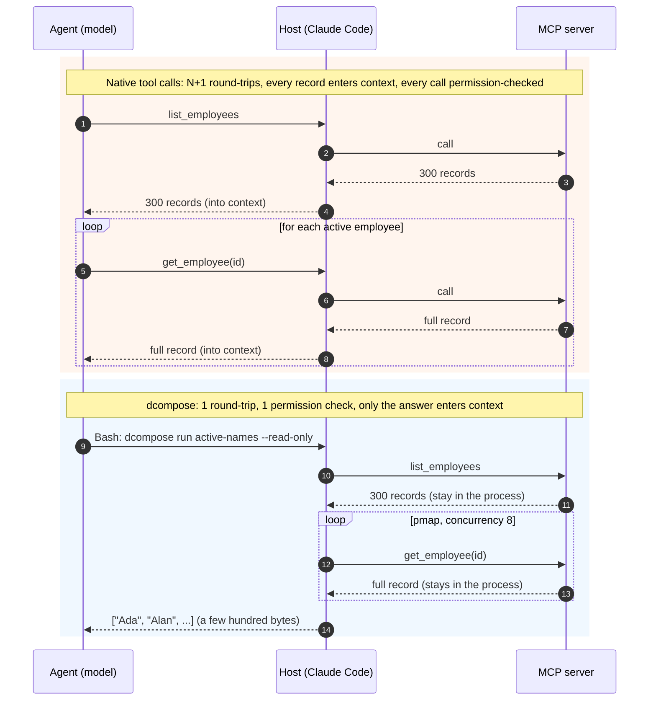

# dcompose

[](https://github.com/NuclearTacos/dcompose/actions/workflows/ci.yml)
[](LICENSE)


**Code Mode for the shell.** Compose several MCP tool calls in one TypeScript script so only
the answer reaches the agent, not every intermediate record.

An agent using MCP tools directly pays a full model round-trip per call and carries every
result in its context for the rest of the conversation. A list-then-lookup task over 300
records is 300 turns and megabytes of context. dcompose lets the agent write the loop instead,
run it in one shell command, and get back a few hundred bytes.



The permission point matters in practice. Claude Code checks each tool call against its
permission rules, prompts, or auto-mode classifier. Native usage means N checks, one per call.
A dcompose run is one shell command, so it is checked once. That is faster and less noisy, and
it is also why the guardrail flags exist: a single approval covers everything the script does,
so `--read-only`, `--allow`, and `--max-calls` are how you bound it.

```ts
// .dcompose/scripts/active-names.ts
import type { Ctx } from "dcompose";

export default async function ({ mcp, pmap }: Ctx) {
  const all = await mcp.hr.list_employees({});
  const active = all.filter((e) => e.active);
  return pmap(active, async (e) => (await mcp.hr.get_employee({ id: e.id })).name, { concurrency: 8 });
}
```

```sh
dcompose run active-names --read-only
```

## Measured

Same task, same live PagerDuty MCP server, same 12 API calls: a two-day incident digest
(three pages of 100 incidents, then note lookups on the top three services).

|                                    | dcompose                               | Native tool calls from Claude Code                      |
| ---------------------------------- | -------------------------------------- | ------------------------------------------------------- |
| Model round-trips                  | **1**                                  | 8                                                       |
| Wall clock                         | **5.5 s** (10.3 s with cold MCP start) | ~90 s                                                   |
| Bytes fetched from the API         | 182 KB                                 | 182 KB                                                  |
| Bytes entering the agent's context | **940 B**                              | the host refused each 60 KB page and spilled it to disk |

The last row is the real finding. At this data size the conventional path is not possible as
pure tool calls; the host forces an improvised file-plus-script workaround, which is a worse
version of what dcompose does deliberately.

## How it works

1. **`dcompose servers` / `tools`** connect to the MCP servers in `dcompose.json` (same shape as
   Claude Code's config) and list what is available.
2. **`dcompose types`** turns every tool's input and output schema into a TypeScript
   declaration file, so `ctx.mcp.pagerduty.list_incidents(...)` is strictly typed in scripts
   and the agent reads signatures instead of guessing.
3. The agent writes a script, **`dcompose check`** type-checks it, **`dcompose run`** executes
   it with guardrails and prints the return value as JSON on stdout. Everything else goes to
   stderr, so the output pipes into `jq` like any other tool.
4. **`dcompose init`** writes a `SKILL.md` that teaches Claude Code this loop. A fresh agent
   given only that file solved a cross-entity join task correctly on its first run.

## Install

Requires Node 22.18 or newer (native TypeScript stripping). Not on npm yet.

```sh
git clone https://github.com/NuclearTacos/dcompose && cd dcompose
npm install && npm run build && npm link       # puts `dcompose` on PATH
cd ~/your-project
dcompose init --import-claude                  # seeds servers from ~/.claude.json and ./.mcp.json
dcompose servers
```

## Features

- **Scripts** are plain TypeScript modules. The context provides `mcp.<server>.<tool>()`,
  `call`, `input`, `stdin`, `pmap` (bounded concurrency), `paginate` (cursor paging), `sleep`,
  `emit`, `log`, `store`, `sh`.
- **Streaming**: export an `async function*` and each `yield` is one NDJSON line on stdout,
  immediately. Good for monitors paired with a tail or a Monitor tool.
- **State**: `ctx.store` is a JSON key-value file per script, so a poller remembers what it has
  seen across relaunches.
- **Guardrails**: `--read-only` (from MCP annotations), `--allow` / `--deny` globs,
  `--max-calls`, `--timeout`, `--max-output-bytes`, `--dry-run`, `--allow-exec`. A guardrail
  hit exits 2; a script error exits 1; a config error exits 3. Agents branch on that.
- **Traces**: every run writes an NDJSON file with one line per tool call. `dcompose runs show`
  renders it; `--trace` streams the same records to stderr live.
- **Daemon**: `dcompose daemon start` keeps MCP connections warm per project. `tools` against a
  `uvx` server went from 3.0 s to 0.4 s. Falls back to direct connections when absent.
- **Shell-native**: `dcompose eval '<code>'` for one-liners, `dcompose call server.tool --each`
  to map a tool over NDJSON stdin, `-r` / `--jsonl` / `-c` output shaping like `jq`.
- **Windows first-class**: named-pipe daemon, `npx`/`uvx` spawning, tested in CI on Windows
  and Linux.

## Commands

```
init [--import-claude]           create dcompose.json, .dcompose/, and the agent SKILL.md
servers                          connection status and tool counts
tools [server] [--grep]          server.tool, one-line description, [read-only] marker
call <server.tool> [json]        one call; --each maps over NDJSON stdin
run <script> [-i json]           run a script (bare names resolve under .dcompose/scripts/)
eval '<code>'                    inline script body with the same context
types                            generate .dcompose/types/mcp.d.ts
check [scripts...]               type-check scripts against the generated types
runs [show <id|--label>]         inspect past runs
auth <server>                    OAuth 2.1 sign-in for a remote server (tokens under ~/.dcompose/auth/)
where                            paths dcompose will use from this directory (root, config, scripts, runs)
import [names...] [--user]       copy servers from Claude Code's config into ~/.dcompose/config.json
skill [--user|--project]         write the Claude Code skill files (SKILL.md, patterns.md, pitfalls.md)
daemon start|stop|status|log     warm-connection daemon
```

## Configuration

Resolution order, later wins per server name: `~/.dcompose/config.json`, then `./dcompose.json`
(commit this, use `${ENV_VAR}` for secrets), then `./dcompose.local.json` (gitignored; where
`--import-claude` writes). Entries use Claude Code's `mcpServers` shape.

A directory with no project config still works on the user-level file alone, and its runs,
state, and generated types go to a per-directory workspace under `~/.dcompose/workspaces/`
rather than into that directory. This is how to use dcompose inside repos you do not want to
add files to: put the servers in `~/.dcompose/config.json`, install the skill once per user
with `dcompose skill --user` (Claude Code reads `~/.claude/skills/` in every session), and run
`dcompose where` from the repo to see which paths will be used. `DCOMPOSE_HOME` relocates `~/.dcompose` entirely (config,
OAuth tokens, daemon sockets, workspaces); the test suite uses it for isolation.

```json
{
  "mcpServers": {
    "pagerduty": { "command": "uvx", "args": ["pagerduty-mcp"], "env": { "PAGERDUTY_API_KEY": "${PD_KEY}" } },
    "datagrip": { "type": "http", "url": "http://127.0.0.1:64402/stream" }
  },
  "defaults": { "maxCalls": 200, "timeout": "5m", "concurrency": 5 },
  "daemon": { "autoStart": false, "idle": "1h" }
}
```

## Limits worth knowing

- dcompose is a separate process, so it can only reach servers it can connect to itself:
  stdio servers, HTTP servers with header auth, and HTTP servers you sign in to once with
  `dcompose auth`. Claude.ai-hosted connectors are unreachable by design; their tokens never
  leave Anthropic.
- Output types are only as good as the server's declared `outputSchema`. Undeclared fields
  type as `any` rather than erroring, and the SKILL.md tells the agent to probe one call first.
- Guardrails bound a run; they do not sandbox it. See [SECURITY.md](SECURITY.md).

## Project

- [DESIGN.md](DESIGN.md): the reasoning, the CLI-versus-MCP-server decision, the auth regimes,
  and the roadmap (packs, then MCP-server mode).
- [EXAMPLES.md](EXAMPLES.md): target usage from the agent's point of view.
- [examples/](examples/): real scripts that ran against PagerDuty during development.
- [CHANGELOG.md](CHANGELOG.md), [CONTRIBUTING.md](CONTRIBUTING.md), [SECURITY.md](SECURITY.md).

`npm run ci` runs typecheck, lint, format check, build, and the 60-test suite, which drives
the real CLI against an in-repo MCP fixture server. No network or credentials needed.

MIT. Built with Claude Code; commits carry the co-author trailer.
